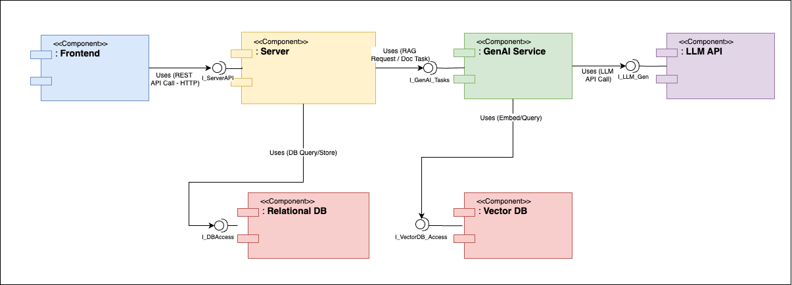

# LECture-bot: System Architecture Explanation

This document describes the component-based architecture of the LECture-bot system, as depicted in the `component-diagram.png`.

The architecture outlines the major software components, their provided interfaces, and the dependencies between them.

## 1. Overview

The system is designed with a modular approach, separating concerns into distinct components that communicate through well-defined interfaces. The primary actor is the "Student User."

## 2. Components and Interfaces

### 2.1. Student User (Actor)

* **Description:** The end-user of the LECture-bot application.
* **Interaction:** Interacts with the system primarily through the Frontend component via HTTP requests.

### 2.2. Frontend (Component `<<Component>> :Frontend`)

* **Description:** The client-side user interface of the application. This is what the student user directly interacts with.
  * *Technology :* React.
* **Provided Interface:** None explicitly shown as a lollipop for other components to consume, as it's the primary interaction point for the actor.
* **Required Interface / Dependency:**
  * Uses the `I_ServerAPI` provided by the `Server` component. This interaction is labeled "Uses (REST API Call - HTTP)".

### 2.3. Server (Component `<<Component>> :Server`)

* **Description:** The main backend application logic. It orchestrates business operations and data management.
  * *Technology :* Spring Boot, containing multiple microservices (User & Course Service, Document Processing Service, Query Orchestration Service, Flashcard Service).
* **Provided Interface:**
  * `I_ServerAPI` (lollipop): This interface is consumed by the `Frontend` component for all its backend requests.
* **Required Interfaces / Dependencies:**
  * Uses the `I_GenAI_Tasks` interface provided by the `GenAI Service` component. This interaction is labeled "Uses (RAG Request / Doc Task)".
  * Uses the `I_DBAccess` interface provided by the `Relational DB` component. This interaction is labeled "Uses (DB Query/Store)".

### 2.4. GenAI Service (Component `<<Component>> :GenAI Service`)

* **Description:** This component encapsulates all Generative Artificial Intelligence and Natural Language Processing functionalities, including document indexing, embedding, and interaction with Large Language Models for Q&A and flashcard generation.
  * *Technology :* Python with LangChain.
* **Provided Interface:**
  * `I_GenAI_Tasks` (lollipop): This interface is consumed by the `Server` component for AI-related processing.
* **Required Interfaces / Dependencies:**
  * Uses the `I_LLM_Gen` interface provided by the `LLM API` component. This interaction is labeled "Uses (LLM API Call)".
  * Uses the `I_VectorDB_Access` interface provided by the `Vector DB` component. This interaction is labeled "Uses (Embed/Query)".

### 2.5. LLM API (Component `<<Component>> :LLM API`)

* **Description:** Represents the external or internal Large Language Model service that provides text generation and understanding capabilities.
  * *Technology :* Cloud-based (e.g., OpenAI) or local LLM.
* **Provided Interface:**
  * `I_LLM_Gen` (lollipop): This interface is consumed by the `GenAI Service`.
* **Required Interface / Dependency:** None shown to other components within this diagram's scope.

### 2.6. Relational DB (Component `<<Component>> :Relational DB`)

* **Description:** The primary structured data store for the application (e.g., user data, course information, document metadata).
  * *Technology :* PostgreSQL.
* **Provided Interface:**
  * `I_DBAccess` (lollipop): This interface is consumed by the `Server` component for data persistence operations.
* **Required Interface / Dependency:** None shown to other components within this diagram's scope.

### 2.7. Vector DB (Component `<<Component>> :Vector DB`)

* **Description:** A specialized database for storing and querying vector embeddings of document content, crucial for the RAG process.
  * *Technology :* Weaviate.
* **Provided Interface:**
  * `I_VectorDB_Access` (lollipop): This interface is consumed by the `GenAI Service` for storing and retrieving embeddings.
* **Required Interface / Dependency:** None shown to other components within this diagram's scope.

## 3. Key Interaction Summary

* The **Student User** interacts with the **Frontend**.
* The **Frontend** relies on the **Server** to fulfill user requests.
* The **Server** delegates AI-specific tasks to the **GenAI Service** and data storage/retrieval to the **Relational DB**.
* The **GenAI Service** further relies on the **LLM API** for generative capabilities and the **Vector DB** for managing embeddings.

Each dependency is shown via a dashed arrow from the dependent component to the provided interface (lollipop) of the component it uses. This visualizes the flow of control and data, highlighting the modular and interconnected nature of the LECture-bot system.
