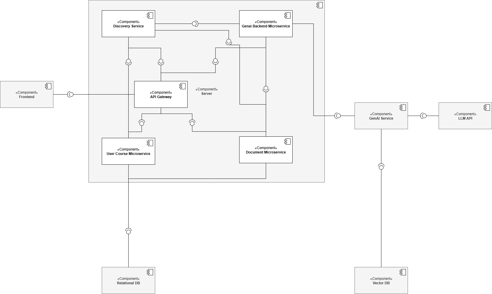

# LECture-bot: System Architecture Explanation

This document describes the component-based architecture of the **LECture-bot** system, as depicted in the `component-diagram.png`.

The architecture outlines the major software components and interfaces required.

---

## 1. Overview

The system is designed with a modular approach, separating concerns into distinct components that communicate through interfaces. The primary actor (student user) interacts with the system through a web-based frontend, which communicates with backend services via an API Gateway.

---

## 2. Components and Interfaces

### 2.1. Frontend
- **Description:** Client-side user interface.
- **Technology:** React
- **Provided Interface:** Not applicable (entry point for the actor).
- **Required Interface:**
  - API Gateway interface (for login, course selection, document upload, flashcard generation, and question answering).

### 2.2. API Gateway
- **Description:** Single entry point for all client requests, routing traffic to appropriate backend services.
- **Technology:** Java, Spring Boot
- **Provided Interface:**
  - Gateway API interface (used by the Frontend).
- **Required Interface:**
  - Microservice APIs (User Course, Document, GenAI Backend Microservice).
  - Discovery Service interface (for dynamic service lookup).

### 2.3. Discovery Service
- **Description:** Service registry that allows backend services and the API Gateway to discover and communicate with each other dynamically.
- **Technology:** Eureka
- **Provided Interface:**
  - Service Registry interface (used by backend services and by the API Gateway).
- **Required Interface:** Not applicable

### 2.4. Server
- **Description:** Logical grouping of backend microservices that orchestrate business logic.
- **Technology:** Java, Spring Boot
- **Provided Interface:**
  - Microservice APIs (used by the API Gateway).

#### Contained Microservices:

##### 2.4.1. User Course Microservice
- **Description:** Manages user accounts, authentication, and course metadata.
- **Provided Interface:**
  - User/Course API (used by the API Gateway).
- **Required Interface:**
  - Discovery Service interface (for registration).
  - Relational DB interface (for storage).

##### 2.4.2. Document Microservice
- **Description:** Handles uploaded documents and preprocessing (e.g., text extraction).
- **Provided Interface:**
  - Document API (used by the API Gateway).
- **Required Interface:**
  - Discovery Service interface (for registration).
  - GenAI Service API (for further processing).
  - Relational DB interface (for metadata).

##### 2.4.3. GenAI Backend Microservice
- **Description:** Orchestrates query answering and flashcard generation.
- **Provided Interface:**
  - GenAI Backend API (used by the API Gateway).
- **Required Interface:**
  - Discovery Service interface (for registration).
  - GenAI Service API.
  - Relational DB interface.

### 2.5. GenAI Service
- **Description:** Handles AI tasks like embedding, retrieval-augmented generation, and LLM interactions.
- **Technology:** Python, LangChain
- **Provided Interface:**
  - GenAI Service API interface (used by the GenAI Backend Microservice and Document Microservice).
- **Required Interface:**
  - LLM API interface (for prompt completion and generation).
  - Vector Database interface (for storing and retrieving vector embeddings).

### 2.6. LLM API
- **Description:** External or internal large language model service that processes prompts and returns generated output.
- **Provided Interface:**
  - LLM API interface (used by the GenAI Service).
- **Required Interface:** Not applicable

### 2.7. Relational DB
- **Description:** Structured data store for users, courses, documents, and flashcards.
- **Technology:** PostgreSQL
- **Provided Interface:**
  - Relational Database interface (used by User Course Microservice, Document Microservice, and GenAI Backend Microservice).
- **Required Interface:** Not applicable

### 2.8. Vector DB
- **Description:** Specialized database for storing and querying vector embeddings. Manages vector-based search for semantic document retrieval.
- **Technology:** Weaviate
- **Provided Interface:**
  - Vector Database interface (used by the GenAI Service).
- **Required Interface:** Not applicable

---

## 3. Summary

- The **Frontend** communicates exclusively with the **API Gateway**, which routes traffic to backend microservices.
- The **API Gateway** dynamically discovers microservices via the **Discovery Service**.
- Each backend microservice (User Course, Document, GenAI Backend) registers itself with the **Discovery Service**.
- The **GenAI Backend Microservice** use the **GenAI Service** for AI-powered operations and the **Relational DB** for persistent storage.
- The **GenAI Service** in turn depends on the **LLM API** for generation tasks and the **Vector DB** for semantic retrieval.

This architecture promotes modularity, service discovery, and scalability across the LECture-bot platform.

