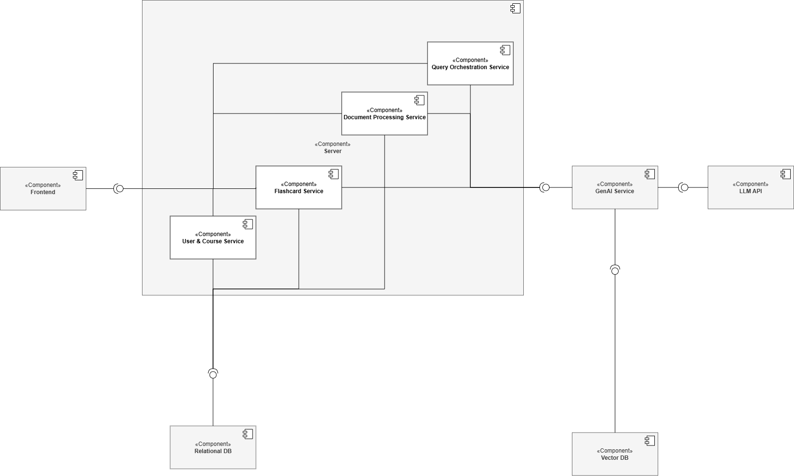

# LECture-bot: System Architecture Explanation

This document describes the component-based architecture of the **LECture-bot** system, as depicted in the `component-diagram.png`.

The architecture outlines the major software components and interfaces required.

---

## 1. Overview

The system is designed with a modular approach, separating concerns into distinct components that communicate through interfaces. The primary actor (student user) interacts with the system through a web-based frontend.

---

## 2. Components and Interfaces

### 2.1. Frontend

- **Description:** Client-side user interface.
- **Technology:** React
- **Provided Interface:** Not applicable (entry point for the actor).
- **Required Interface:**
  - Backend API interface provided by the **Server** (REST API for login, course selection, document upload, flashcard generation, and question answering).

---

### 2.2. Server

- **Description:** Main backend application, orchestrating business logic.
- **Technology:** Java, Spring Boot
- **Provided Interface:**
  - Backend API interface (used by the **Frontend**).
- **Required Interface:**
  - GenAI Service API interface (for AI tasks such as embedding, RAG, and LLM interaction).
  - Relational Database interface (for persistent storage of users, courses, documents, and flashcards).

#### Internal Services:

- **User & Course Service**
  - Manages user accounts, authentication, and course metadata.
  - Stores/retrieves user and course data from the **Relational DB**.

- **Document Processing Service**
  - Handles uploaded documents (e.g., text extraction).
  - Sends processed content to the **GenAI Service**.
  - Stores/retrieves document data from the **Relational DB**.

- **Query Orchestration Service**
  - Coordinates query answering and flashcard generation.
  - Delegates tasks to **GenAI Service**.

- **Flashcard Service**
  - Stores and retrieves flashcards.
  - Sends processed content to generate flashcards to the **GenAI Service**.
  - Stores/retrieves flashcard data from the **Relational DB**.

---

### 2.3. GenAI Service

- **Description:** Handles AI tasks like embedding, retrieval-augmented generation, and LLM interactions.
- **Technology:** Python, LangChain
- **Provided Interface:**
  - GenAI Service API interface (used by the **Server**).
- **Required Interface:**
  - LLM API interface (for prompt completion and generation).
  - Vector Database interface (for storing and retrieving vector embeddings).

---

### 2.4. LLM API

- **Description:** External or internal large language model service that processes prompts and returns generate output.
- **Provided Interface:**
  - LLM API interface (used by the **GenAI Service**).
- **Required Interface:** Not applicable

---

### 2.5. Relational DB

- **Description:** Structured data store for users, courses, documents, and flashcards.
- **Technology:** PostgreSQL
- **Provided Interface:**
  - Relational Database interface (used by the **Server**).
- **Required Interface:** Not applicable

---

### 2.6. Vector DB

- **Description:** Specialized database for storing and querying vector embeddings. Manages vector-based search for semantic document retrieval.
- **Technology:** Weaviate or similar
- **Provided Interface:**
  - Vector Database interface (used by the **GenAI Service**).
- **Required Interface:** Not applicable

---

## 3. Summary

* The **Frontend** relies on the **Server** to fulfill user requests.
* The **Server** delegates AI-specific tasks to the **GenAI Service** and data storage/retrieval to the **Relational DB**.
* The **GenAI Service** further relies on the **LLM API** for generative capabilities and the **Vector DB** for managing embeddings.

The diagram  visualizes the flow of control and data, highlighting the modular and interconnected nature of the LECture-bot system.